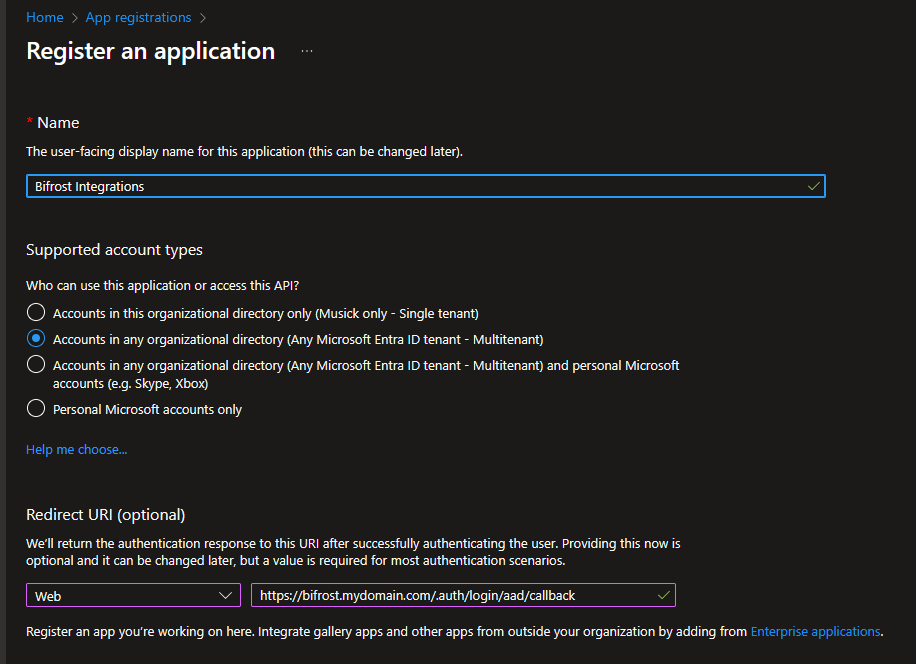
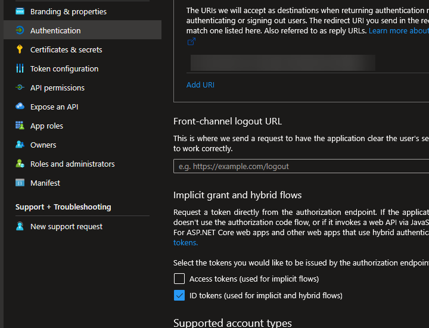
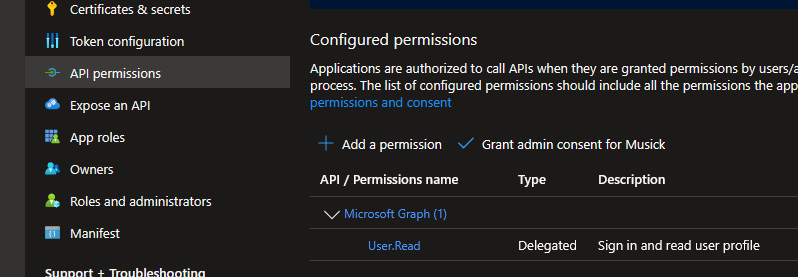

## Table of Contents

- [Prerequisites](#prerequisites)
- [Infrastructure Overview](#infrastructure-overview)
- [Deployment Steps](#deployment-steps)
- [Post-Deployment Configuration](#post-deployment-configuration)

## Prerequisites

Before deploying to Azure, you need an active Azure Subscription.

### Required Permissions

Your Azure account needs these permissions:

- Create resource groups
- Create storage accounts
- Create function apps
- Create key vaults
- Create application insights
- Create static web apps

## Infrastructure Overview

The ARM template creates the following Azure resources:

- **Azure Functions (Flex Consumption Plan)** - Serverless backend runtime
- **Storage Account (Standard_LRS)** - Tables and file storage
- **Azure Key Vault** - Secure secrets management
- **Application Insights** - Performance monitoring and diagnostics
- **Static Web App** - React frontend hosting

## Deployment Steps

### Entra App Registration

1. Login to [Entra](https://entra.microsoft.com).
1. Navigate to App Registrations.
1. Click **New Registration**.

   - For the name, put whatever you want like `Bifrost Integrations` or `MyMSP Automation`.
   - For the account types, select Multitenant unless you do _NOT_ have customers or partners that need to login and run forms.
   - For the Redirect URI, select **Web** as the platform and type in the URL you intend to use for the application. This can be changed later. Example:

     `https://bifrost.mydomain.com/.auth/login/aad/callback`

   

1. Under **Overview**, copy your Application ID. You'll need this later.
1. Under **Certificates & Secrets**, create a new client secret and copy this somewhere. You'll need this later.
1. Under **Authentication**, enable ID tokens.

   

1. Under API Permissions, grant admin consent.

   

### Send it!

Fork the [API](https://github.com/jackmusick/bifrost-api) and [Client](https://github.com/jackmusick/bifrost-client) repository.

Use the below Deploy to Azure button to automatically setup all of your resources. Azure will ask you for the Entra ID Client ID and Secret you created above.

> Set a reminder to update renew your Client Secret and update it on the Static Web App's configuration page.

## Next Steps

Setup [GitHub Actions](./github-actions.md) for automated deployment setup.
